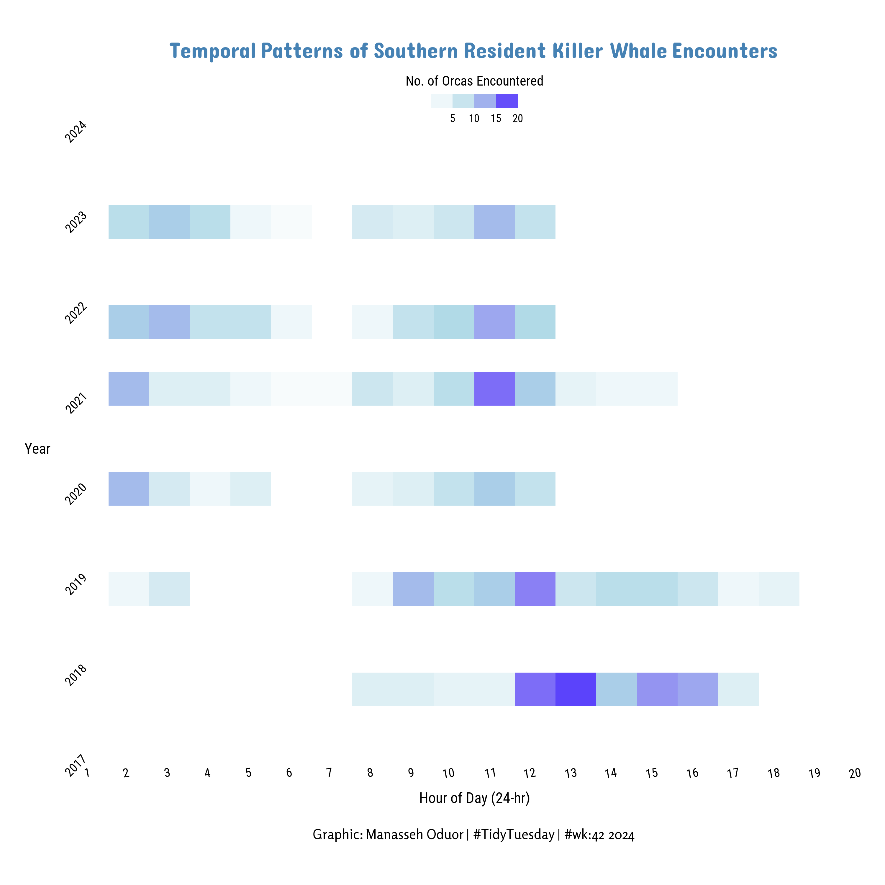

```{r setup, include=FALSE}
knitr::opts_chunk$set(echo = TRUE)
```

## Linki oraz oryginalny wykres

Link do posta: https://x.com/Manasseh_6/status/1847299325140799893?s=20

Link do zestawu danych: https://github.com/rfordatascience/tidytuesday/blob/main/data/2024/2024-10-15/orcas.csv



## Nieprawidłowości Powyższego wykresu

1. Tło wykresu jest białe i ciężko odróżnić, czy w danym roku i godzinie nie było danych, czy była mała wartość. Ciężko odczytać godzinę dla wyższych lat z powodu dużych przerw między wierszami.
2. Zły zakres obu osi - wykres pomija godziny, zamiast pokazywać pełną dobę dla każdego roku, oraz nie widoczne są dane dla lat 2017 i 2024, mimo że są one na osi y. 

## Poprawiony kod i wykres

```{r, fig.width=10, fig.height=6}

# install.packages('pacman')
pacman::p_load(tidyverse, lubridate, ggtext, showtext)

font_add_google(name = "Roboto Condensed")
font_add_google(name = "Ubuntu Condensed")
font_add_google(name = "Rosario")
font_add_google(name = "Dangrek")

showtext_auto()
showtext_opts(dpi = 150)

tuesdata <- tidytuesdayR::tt_load(2024, week = 42)
orcas <- tuesdata$orcas

orcas_df <- orcas %>%  
  mutate(begin_hour = hour(hms::as_hms(begin_time))) %>% 
  select(year, begin_hour)

min_year <- min(orcas_df$year, na.rm = TRUE)
max_year <- max(orcas_df$year, na.rm = TRUE)

ggplot(orcas_df, aes(x = year, y = begin_hour)) +
  geom_bin2d(binwidth = c(1, 1), boundary = 0.5, na.rm = TRUE) +
  
  scale_fill_gradientn(
    colors =  c("#E0F7FA", "#0288D1", "#01579B"),
    na.value = "white",
    breaks = c(5, 10, 15, 20),
    labels = as.character(c(5, 10, 15, 20)),
    guide = guide_colorsteps(
      title = "No. of Orcas Encountered", title.position = "top", title.hjust = 0.5, 
      barheight = unit(0.4, "cm"), 
      barwidth = unit(2.5, "cm"))) +
  scale_x_continuous(breaks = seq(min_year, max_year, by = 1), 
                     expand = expansion(add = 0.5)) +  
  scale_y_continuous(limits = c(0, 24), 
                     breaks = seq(0, 24, by = 3), 
                     expand = c(0, 0)) +
  theme_void() + 
  coord_flip() +
  labs(
    title = "Temporal Patterns of Southern Resident Killer Whale Encounters",
    x = "Year", y = "Hour of Day (24-hr)") +
  theme(
    text = element_text(family = "Roboto Condensed"),
    panel.background = element_rect(fill = "white", color = NA),
    panel.grid.major.y = element_line(color = "grey92", linewidth = 0.5),
    panel.grid.major.x = element_line(color = "grey95", linewidth = 0.3),
    legend.position = "top",
    axis.ticks = element_line(color = "black"),
    axis.text.x = element_text(size = 10, angle = 0, hjust = 0.5, margin = margin(t=5)),
    axis.text.y = element_text(size = 10, margin = margin(r=5)),
    strip.text = element_text(size = 16, color = "#354259", family = "Roboto Condensed"),
    plot.title = element_markdown(size = 18, hjust = 0.5, colour = "steelblue", face = "bold", family = "Dangrek", margin = margin(t = 5, b = 10)),
    axis.title.x = element_text(size = 12, margin = margin(t = 10)),
    axis.title.y = element_text(size = 12, margin = margin(r = 10), angle = 90),
    plot.caption = element_markdown(colour = 'black', hjust = 0.5, size = 11, family = 'Rosario', margin = margin(t = 20, b = 5)),
    plot.margin = margin(b=30, t=30, r=20, l=20)
  )

ggsave("orcas_fixed.png", width = 10, height = 6, bg = "white", dpi = 150)
```

## Uzasadnienie

Poprawiona wizualizacja uwzględnia pełny zakres doby (0–24h) oraz brakujące wcześniej dane dla lat 2017 i 2024, eliminując mylące luki w osiach czasu. Ponadto zastosowanie zwartego układu z liniami siatki wraz ze zmianą skali kolorów znacząco poprawiają czytelność.(do tego skala na osi x nie jest tak gęsta).


