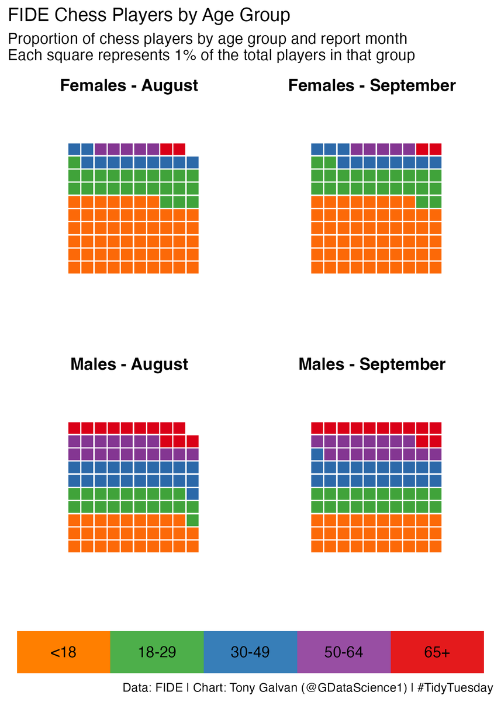
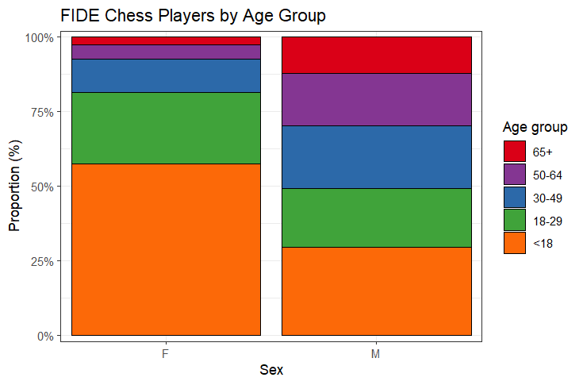

## Wizualizacja graczy szachowych

### Oryginalna wizualizacja

[Link do wizualizacji](https://x.com/GDataScience1/status/1972740094089154684)

[Link do danych](https://github.com/rfordatascience/tidytuesday/tree/main/data/2025/2025-09-23)

### Problemy z oryginalną wizualizacją

W wizualizacji z sierpnia brakuje jednego kwadracika, udziały nie sumują się do 100%.

Wizualizacje z sierpnia i września są bardzo podobne do siebie, nie ma sensu ich rozdzielać.

### Poprawiona wizualizacja

Zastosowanie wykresu słupkowego pozwala uniknąć zaokrągleń do pełnego procenta, dzięki temu nie ma "brakującego kwadracika". Dane z sierpnia i września zostały dodane ze względu na niewielkie różnice pomiędzy nimi. Dzięki temu mamy tylko 2 słupki zamiast 4 wykresów, jest łatwiej odczytać dane. Moim zdaniem łatwiejsze jest odczytanie proporcji ze słupka niż kwadracików. Umieszczenie słupków podziału na płeć obok siebie pozwala na ich bezpośrednie porównanie.
