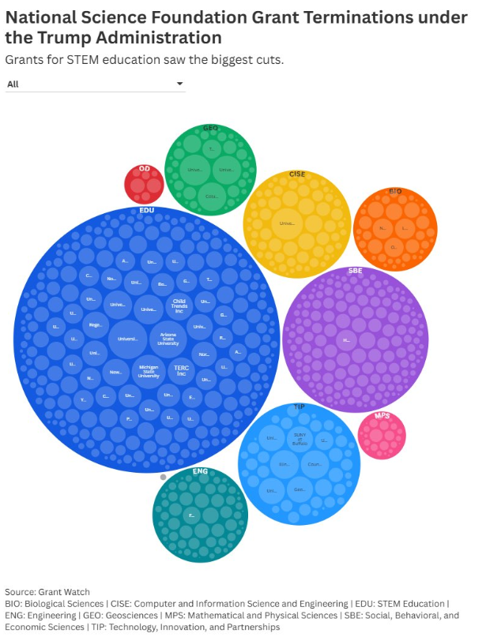

```{r setup, include=FALSE}
knitr::opts_chunk$set(echo = TRUE)
library(dplyr)
library(ggplot2)
library(tidyr)

### Wczytanie danych
nsf_terminations <-read.csv('https://raw.githubusercontent.com/rfordatascience/tidytuesday/main/data/2025/2025-05-06/nsf_terminations.csv')

```

## Oryginalna wizualizacja - dane
Znalazłam na X wizualizację uciętych dotacji naukowych przez administrację Trumpa w 2025 roku: https://x.com/hannah_holtz/status/1920629407745540436

Link do użytych danych: https://github.com/rfordatascience/tidytuesday/blob/main/data/2025/2025-05-06/readme.md



## Oryginalna wizualizacja - błędy
Na pierwszy rzut oka wizualizacja jest już bardzo nieczytelna: nie wiadomo co jest napisane w małych kółkach zawartych w dużych kółkach. Dodatkowo to jakim kategoriom odpowiadają duże koła jest nieczytelne. Legenda do odczytania skrótów jest mała i szara - nie do oczytania. Nie do końca wiadomo co autor miał na myśli i jak oczekiwał, że wszystko zostanie odczytane.

## Moja propozycja wizualizacji


```{r zadanie 1, message=FALSE}
nsf_terminations %>%
  filter(!is.na(directorate)) %>% 
  count(directorate) %>%
  ggplot(aes(x = reorder(directorate, n), y = n)) +
  geom_col(fill="#4C72B0") +
  coord_flip() +
  labs(
    title = "National Science Foundation Grant Terminations\nunder the Trump Administration",
    subtitle = "Grants for STEM education saw the biggest cuts.",
    x = "NSF directorate (the highest level of organization)",
    y = "Number of cut grants",
  ) +
  theme_minimal()+
  theme(
    plot.title = element_text(face = "bold", size = 12, hjust = 0),
  plot.subtitle = element_text(size = 10, hjust = 0)
  )


```


## Czemu mój wykres jest lepszy
Po pierwsze mamy od razu czytelną ilość każdej z dotacji. Nie trzeba zgadywać, ile czego ucięli. Dodatkowo od razu widać nazwy zarządów, nie trzeba patrzeć na dopisek na dole. Ucięłam grupowanie na uniwersytety, które chyba zrobiła tamta Pani bo jest ich w USA bardzo dużo i za dużo to do wizualizacji nie wnosiło - wręcz powodowało większy chaos. Dodatkowo wykres przedstawia dokładnie to co tytuł sugeruje.


