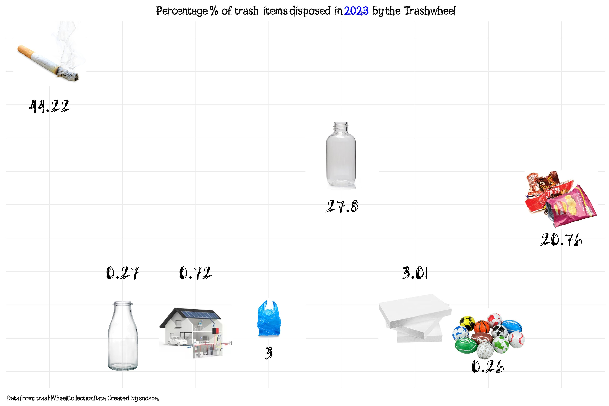

```{r setup, include=FALSE}
knitr::opts_chunk$set(echo = TRUE)
library(dplyr)
library(ggplot2)
#wczytanie danych
trashwheel <- read.csv('https://raw.githubusercontent.com/rfordatascience/tidytuesday/master/data/2024/2024-03-05/trashwheel.csv')

```

## Wizualizacja z #TidyTuesday do poprawy


[Link do posta z wizualizacją](https://x.com/simisani10/status/1767540926304415942) 


[Link do zestawu danych](https://raw.githubusercontent.com/rfordatascience/tidytuesday/master/data/2024/2024-03-05/trashwheel.csv)


Nieprawidłowości w powyższej wizualizacji:  
* Brak oznaczeń osi.  
* Nieczytelność elementów (brak podpisów dla grafik utrudnia rozpoznanie rodzaju odpadu).  
* Błąd w interpretacji danych - po zapoznaniu się z opisem danych okazuje się, że w kolumnie 'HomesPowered' nie jest przedstawiona liczba odpadów, a szacowana liczba domów, które można zasilić energią pozyskaną z zebranych odpadów: "Homes Powered - Each ton of trash equates to on average 500 kilowatts of electricity. An average household will use 30 kilowatts per day.". Autor powyższej wizualizacji uznał te dane jako odpady i zamieścił je na wykresie przy zdjęciu domu jednorodzinnego.  
* Nieprawidłowy układ wartości - wartości 0.27 i 0.72 są wyżej niż wartość 3.  


## Poprawiona wersja wizualizacji

```{r poprawienie wizualizacji}
trashwheel <- trashwheel %>% 
  filter(Year == 2023, Name == 'Mister Trash Wheel')
df <- data.frame( 'type_of_waste' = colnames(trashwheel)[9:15],
                  'count' = c(
sum(as.numeric(trashwheel$PlasticBottles), na.rm = TRUE), sum(as.numeric(trashwheel$Polystyrene), na.rm = TRUE), sum(as.numeric(trashwheel$CigaretteButts), na.rm = TRUE), sum(as.numeric(trashwheel$GlassBottles), na.rm = TRUE), sum(as.numeric(trashwheel$PlasticBags), na.rm = TRUE), sum(as.numeric(trashwheel$Wrappers), na.rm = TRUE),sum(as.numeric(trashwheel$SportsBalls), na.rm = TRUE)))
total <- sum(df$count)
df %>% 
  mutate(count = (count/total)*100) %>% 
  ggplot(aes(x = reorder(type_of_waste, count), y = count))+
  geom_col(fill = 'darkgreen')+
  theme_minimal()+
  labs(title = 'Percentage % of trash items disposed in 2023 \n by the Trashwheel',
       x = 'Type of waste',
       y = 'Percentage %')+
  theme(
    plot.title = element_text(hjust = 0.5, face = 'bold')
  )+
  geom_text(aes(label = paste0(round(count,2), '%')), hjust = -0.1, size = 3)+
  scale_y_continuous(limits = c(0,55))+
  coord_flip()


```


Dlaczego ten wykres jest lepszy od orginału?  
* Posiada oznaczenia osi.  
* Wszystkie elementy są podpisane.  
* Kolumna 'HomesPowered' nie jest już przedstawiona jako ilość odpadów.  
* Wartości są poprawnie umieszczone na skali.  
