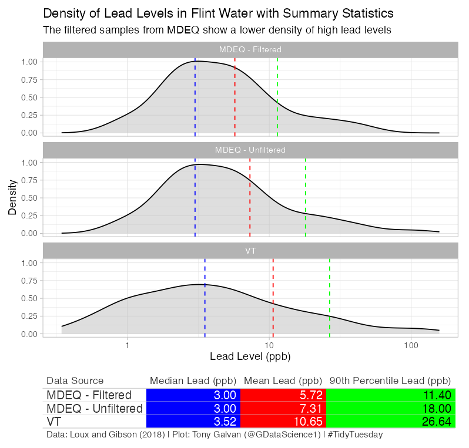
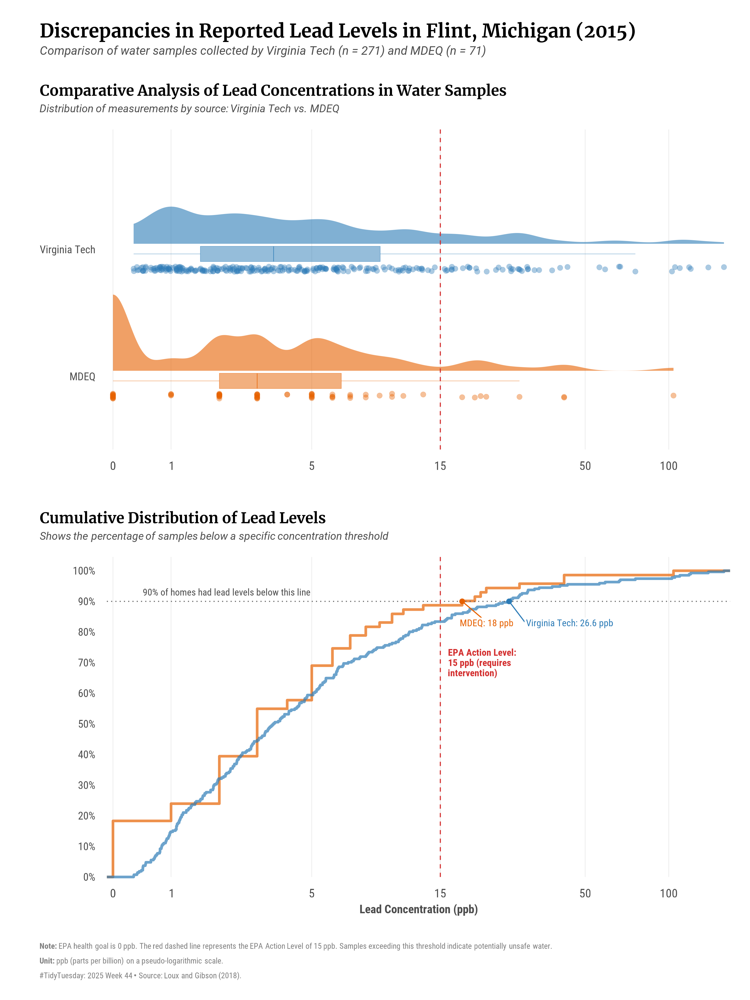

# Praca domowa: Poprawa wizualizacji danych z TidyTuesday
## Dane: 
[Link](https://github.com/rfordatascience/tidytuesday/tree/main/data/2025/2025-11-04)

## Oryginalna wizualizacja

[Link do postu](https://x.com/GDataScience1/status/1988315743193362560?s=20)

## Nieprawidłowości/Elementy wymagające poprawy:
1. Błędy estetyczne i brak dostępności: Tabela pod wykresem wykorzystuje jaskrawe,
nasycone kolory, co obniża czytelność i jest męczące dla wzorku.

2. Nieefektywna prezentacja rozkładu: Wykresy gęstości ukrywają rzeczywistą liczbę próbek
(nie widać dysproporcji w liczebności między MDEQ a Virginia Tech)
oraz spłaszczają długi ogon rozkładu, utrudniając ocenę,
ile próbek faktycznie przekroczyło normę.

3. Oznaczenia na wykresach: Przerywane linie na wykresach nie mówią wprost co oznaczają, choć można się domyślić
czytając tabelkę (kolory odpowiadają danej kolumnie), ponadto wykres nie porusza problemu jakim jest EPA Action Level.

4. Brak wytłumaczenia skrótu: Nie jest oznaczone co oznacza skrót ppb (nie każdy musi to wiedzieć).

## Poprawiona wizualizacja

## Uzasadnienie zmian:
1. Poprawiona paleta barw: Teraz kolory są przyjemne dla oka (nie są aż tak jaskrawe i nasycone) oraz są CVD-safe.

2. Zamiast zwykłego wykresu gęstości, użyłem raincloud plota, który zawiera więcej informacji, dzięki czemu
nie pokazuje aż tak "przekłamanego" spojrzenia na te dane (jitter daje nam spojrzenie na liczbe pomiarów),
liczbę pomiarów umieściłem również w głównym tytule.

3. Linia, która jest ważna w kontekście tych pomiarów została zaznaczona i opisana.

4. Pojawiło się również rozwinięcie skrótu.

5. Dodałem dystrybuante dla danych pomiarowych, oddzielna dla każdej stacji.
