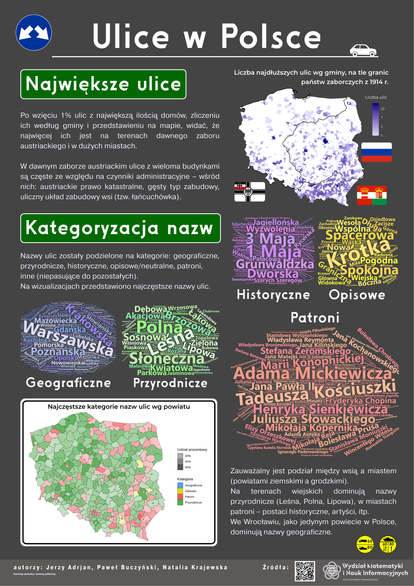

Opis plakatu:

Plakat przedstawia dane na temat struktury ulic w Polsce. Na
wizualizacjach ujęte zostały zależności między granicami historycznymi a
długością ulic, przedstawione zostały najczęstsze nazwy ulic z podziałem
na kategorie oraz rozmieszczenie ulic według kategorii w Polsce.
Szczególna uwaga skupiona została na kategoryzacji oraz przedstawieniu
jej na plakacie.

LINKI DO DANYCH:

'TERC_Urzedowy_2025-10-26.csv':
<https://eteryt.stat.gov.pl/eTeryt/rejestr_teryt/udostepnianie_danych/baza_teryt/uzytkownicy_indywidualni/pobieranie/pliki_pelne.aspx?contrast=default>,
"podstawowa/TERC"

simc, ulic, [0-9]{2}:
<https://internet.gov.pl/media/public/docs/address_points.zip>
<https://internet.gov.pl/media/public/docs/teryt.zip>

Year_1914.sh[px]:
<https://conservancy.umn.edu/bitstreams/7a69bf8c-c071-4b4d-a808-279a689910cf/download>

wojewodztwa.sh[px]:
<https://www.gis-support.pl/downloads/2022/wojewodztwa.zip>

pliki z folderu data/granice:
<https://opendata.geoportal.gov.pl/prg/granice_archiwalne/PRG_jednostki_administracyjne_2024.zip>
(shp, shx)

Pliki wrzucić do folderu data bez zmiany nazw plików, wszystkie do
jednego folderu.

**Autorzy:**

Jerzy Adrjan

Paweł Buczyński

Natalia Krajewska

**Plakat:**

