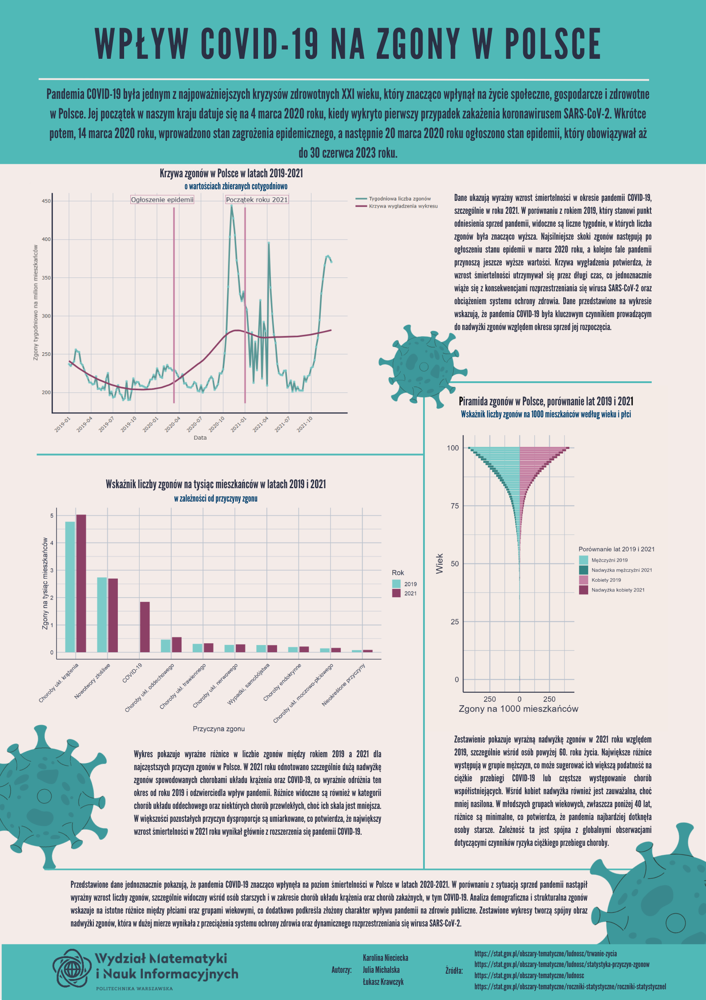

## Wpływ COVID-19 na zgony w Polsce

Plakat przedstawia analizę wpływu pandemii COVID-19 na liczbę zgonów w Polsce w latach 2019-2021. Celem plakatu jest wizualne przedstawienie najważniejszych zmian, jakie pandemia wywołała w strukturze i poziomie umieralności w Polsce, a także ukazanie jej konsekwencji dla zdrowia publicznego.

Autorzy: Karolina Nieciecka, Julia Michalska, Łukasz Krawczyk.

Źródło/a danych:
- https://stat.gov.pl/obszary-tematyczne/ludnosc/ludnosc/zgony-wedlug-tygodni-oraz-wieku-plci-zmarlych-i-73-podregionow-w-2021-roku,39,22.html
- https://stat.gov.pl/obszary-tematyczne/ludnosc/ludnosc/zgony-wedlug-tygodni-oraz-wieku-plci-zmarlych-i-73-podregionow-w-2019-roku,39,20.html
- https://stat.gov.pl/obszary-tematyczne/ludnosc/ludnosc/zgony-wedlug-tygodni-oraz-wieku-plci-zmarlych-i-73-podregionow-w-2020-roku,39,21.html
- https://stat.gov.pl/obszary-tematyczne/ludnosc/trwanie-zycia/trwanie-zycia-tablice-historyczne,1,2.html

