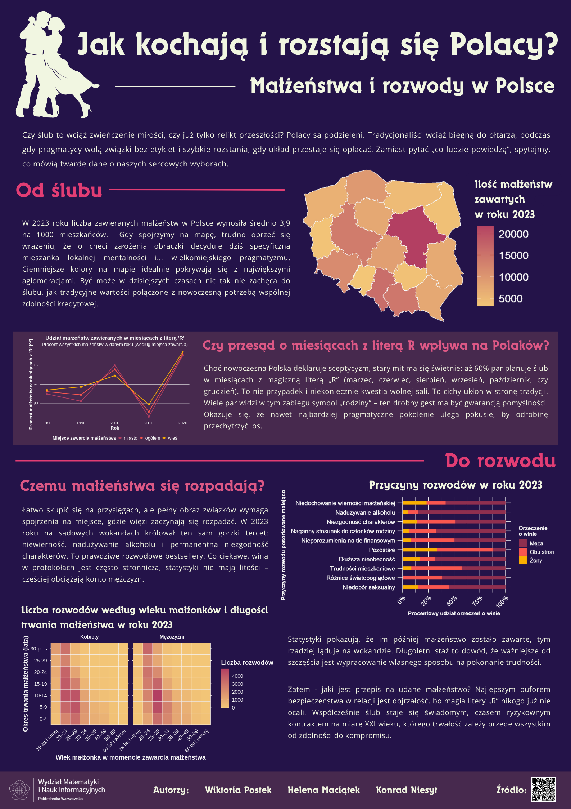

## Jak kochają i rozstają się Polacy?
### Małżeństwa i rozwody w Polsce

**Krótkie Podsumowanie Plakatu** 

Plakat **"Jak kochają i rozstają się Polacy? Małżeństwa i rozwody w Polsce"** to infografika analizująca statystyki małżeństw i rozwodów w Polsce, wskazująca, że w 2023 roku zawierano średnio 3,9 małżeństw na 1000 mieszkańców, z widocznymi różnicami regionalnymi. Mimo pragmatyzmu Polaków, najczęstszymi miesiącami na ślub, pozostają te zawierające literę "R" w nazwie, co świadczy o przywiązaniu do tradycji. Główną przyczyną rozwodów w kraju jest niewierność, nadużywanie  alkoholu i niezgodność charakterów, a pozwy do sądu najczęściej kierują kobiety. Statystyki te pokazują, że trwałość związku w dużej mierze zależy od dojrzałości i wspólnego stażu, niezależnie od panujących trendów.

Autorzy: Helena Maciątek, Konrad Niesyt, Wiktoria Postek.

Źródło danych:
- [Rocznik demograficzny 2024](https://stat.gov.pl/obszary-tematyczne/roczniki-statystyczne/roczniki-statystyczne/rocznik-demograficzny-2024,3,18.html)

