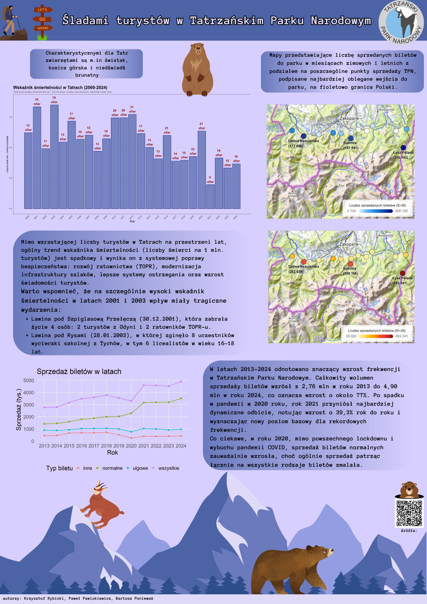

## Śladami turystów w Tatrzańskim Parku Narodowym

Plakat „Śladami turystów w Tatrzańskim Parku Narodowym” przedstawia analizę ruchu turystycznego oraz bezpieczeństwa w polskich Tatrach na przestrzeni ostatnich dwóch dekad (lata 2000–2024). Głównym celem jest przedstawienie rosnącej liczby odwiedzających oraz spadającego wskaźnika śmiertelności. Na plakacie zawarliśmy również mapy porównujące natężenie ruchu w sezonie zimowym i letnim, wskazując najpopularniejsze wejścia do parku, takie jak Łysa Polana czy Dolina Kościeliska.
Autorzy: Bartosz Ponieważ, Krzysztof Rybicki, Paweł Pawlukiewicz

Źródło/a danych:
- [link1](https://tpn.gov.pl/statystyki)
- [link2](https://topr.pl/statystyka/)

