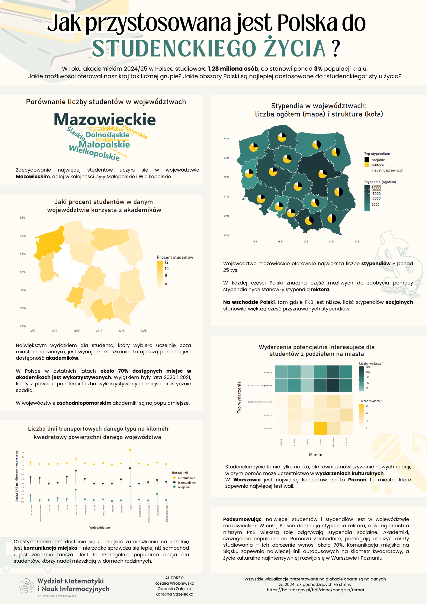

# Jak przystosowana jest Polska do studenckiego życia?

Nasz plakat przedstawia wizualizacje danych na temat szeroko pojętego życia studenckiego w Polsce i jego pewnych aspektów.

Skupiłyśmy się na:
- stypendiach i akademikach, które są dużą pomocą dla studentów.
- dostępności linii transportowych, które są głównym środkiem transportu dla uczniów akademickich, w poszczególnych województwach,
- wydarzeniach kulturalnych, które mogą zainteresować studentów.

Autorzy: Karolina Strzelecka, Gabriela Załęska, Rozalia Wróblewska.

Źródło danych:
Wszystkie wizualizacje prezentowane na plakacie oparte są na danych 
za 2024 rok pochodzących ze strony:
https://bdl.stat.gov.pl/bdl/dane/podgrup/temat

