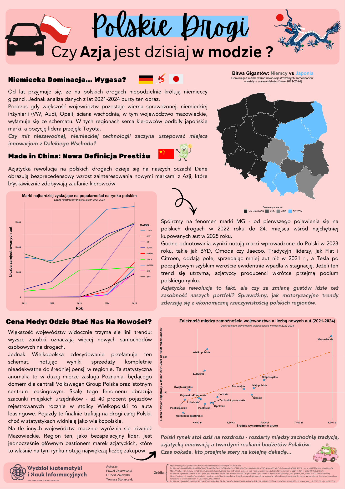

## Polskie drogi - Czy Azja jest dzisiaj w modzie?

Pod lupę wzięliśmy dane o rejestrowanych autach w Polsce w latach 2021-2025. 
Po dogłębnej analizie danych po wcześniejszym ich przeprocesowaniu szczególną naszą uwagę zwróciły marki z Azji bardzo zyskujące na popularności. Byliśmy to w stanie również zauważyć na warszawskich drogach, gdzie takie marki jak BYD i MG, co pokazaliśmy w późniejszej analizie, pojawią się coraz częściej. 
Przeanalizowaliśmy również ilość rejestrowanych aut w danych województwach na podstawie średnich zarobków brutto z okresu 2022-2023, z czego wyciągnęliśmy też ciekawe wnioski - zwłaszcza dla wielkopolski i mazowsza.
Mamy nadzieję, że dostatecznie pokazaliśmy rosnącą siłę azjatyckich pojazdów na polskich drogach!
*****
Dane 2025 mieliśmy niepełne, brakowało nam 3 ostatnich miesięcy - po analizie rejestracji 2021-2024 zauważyliśmy, że w okresie zimowym zakup aut jest bardzo stabilny, bliski średniej z pozostałych 9 miesięcy. Dlatego na potrzeby analizy uzupełniliśmy te 3 miesiące wpisując tam średnią ilość rejestracji od stycznia do ostatniego miesiąca w danych.

Autorzy: Paweł Zakrzewski, Tomasz Stolarczyk, Hubert Zalewski

Źródło/a danych:
https://dane.gov.pl/pl/dataset/2649,marki-samochodow-osobowych-w-2022-roku
https://dane.gov.pl/pl/dataset/3754,marki-samochodow-osobowych-w-2024-roku
https://dane.gov.pl/pl/dataset/2999,marki-samochodow-osobowych-w-roku-2023
https://dane.gov.pl/pl/dataset/4709,marki-samochodow-osobowych-rejestrowanych-w-2025-r
https://dane.gov.pl/pl/dataset/2189,marki-samochodow-osobowych-w-roku-2021
https://stat.gov.pl/sygnalne/komunikaty-i-obwieszczenia/lista-komunikatow-i-obwieszczen/obwieszczenie-w-sprawie-wysokosci-przecietnego-miesiecznego-wynagrodzenia-brutto-w-gospodarce-narodowej-w-wojewodztwach-w-2023-roku,295,10.html
https://stat.gov.pl/obszary-tematyczne/ludnosc/ludnosc/ludnosc-stan-i-struktura-ludnosci-oraz-ruch-naturalny-w-przekroju-terytorialnym-w-2024-r-stan-w-dniu-30-06,6,37.html
https://stat.gov.pl/sygnalne/komunikaty-i-obwieszczenia/lista-komunikatow-i-obwieszczen/obwieszczenie-w-sprawie-wysokosci-przecietnego-miesiecznego-wynagrodzenia-brutto-w-gospodarce-narodowej-w-wojewodztwach-w-2022-roku,295,9.html
	

